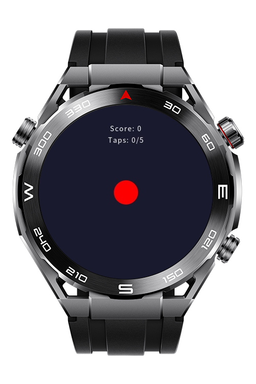
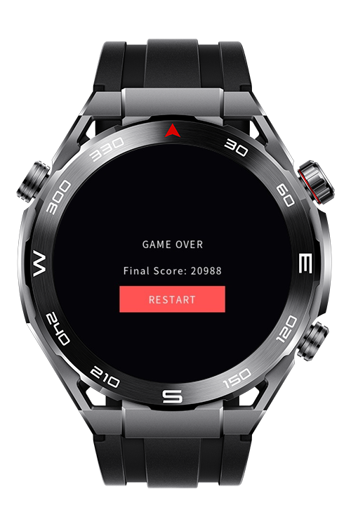

> **Note:** To access all shared projects, get information about environment setup, and view other guides, please visit [Explore-In-HMOS-Wearable Index](https://github.com/Explore-In-HMOS-Wearable/hmos-index).

# Tap The Dot Game

Tap The Dot is a reflex-based game built for HarmonyOS Sport devices. The goal is simple: tap the dot as quickly as possible
when it appears on screen. The game tests your reaction time and gets progressively more difficult as you play.

# Preview

<div>


</div>

## Use Cases

- Simple, addictive gameplay
- Score based on reaction time
- Players start the game by tapping the center dot
- A dot appears randomly on screen
- Player must tap the dot as quickly as possible
- Points are awarded based on reaction time (faster = more points)
- Game ends after 5 successful taps
- Final score displayed with restart option


# Tech Stack

- **Languages**: ArkTS / HML
- **Frameworks**: HarmonyOS SDK 5.0.0(12)
- **Tools**: DevEco Studio 5

# Directory Structure

```
entry/
├── src/main/
├── src/main/js/MainAbility
│ ├── pages/index
│ │ ├── index.css
│ │ ├── index.hml
│ │ └── index.js
```

# Constraints and Restrictions

## Supported Device

- Huawei Sport (Lite) Watch GT 4/5/6
- Huawei Sport (Lite) GT4/5 Pro
- Huawei Sport (Lite) Fit 3/4
- Huawei Sport (Lite) D2
- Huawei Sport (Lite) Ultimate

# LICENSE

**Tap the dot game** is distributed under the terms of the MIT License.
See the [LICENSE](/LICENSE) for more information.